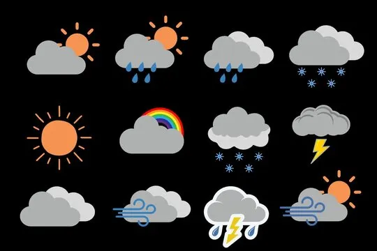
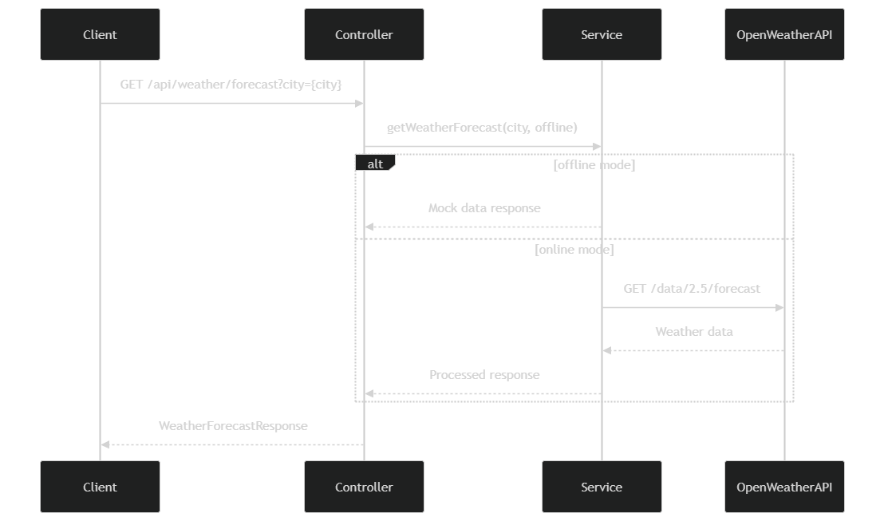

# Weather Prediction Service



A Spring Boot microservice that provides 3-day weather forecasts with personalized recommendations based on weather conditions.

## Features

- 3-day weather forecast for any city worldwide
- Personalized recommendations based on weather conditions
- Fallback to mock data when API is unavailable (offline mode)
- Swagger/OpenAPI documentation
- Responsive web interface with dark/light theme
- Docker container support
- CI/CD pipeline with Jenkins

## Design and Implementation Approach

### Architecture
The service follows a layered architecture:
1. **Presentation Layer**:
    - `WeatherController`: Handles HTTP requests and responses
    - Frontend (index.html): Responsive UI with theme switching

2. **Business Layer**:
    - `WeatherService`: Core business logic for weather data processing
    - Recommendation engine in `DailyForecast`

3. **Data Layer**:
    - Integration with OpenWeatherMap API
    - Mock data fallback mechanism

### Key Implementation Details
- **Resilient Design**: Automatic fallback to mock data when external API fails
- **Real-time Processing**: Aggregates temperature extremes from API slots
- **Dynamic Recommendations**: Generates personalized suggestions based on weather conditions
- **Theme Support**: Persistent dark/light mode using localStorage

### Error Handling Strategy
- Graceful degradation when API unavailable
- Clear error messages for invalid city names
- HTTP status codes aligned with REST best practices

## Design Patterns Used

| Pattern          | Implementation Example | Purpose |
|------------------|------------------------|---------|
| **Facade**       | `WeatherService` | Simplifies complex API interactions |
| **Strategy**     | Online/Offline mode selection | Dynamic behavior switching |
| **Builder**      | `RestTemplateBuilder` | Flexible object construction |
| **Singleton**    | Spring-managed beans | Single instance management |
| **Decorator**    | Recommendation generation | Extends base weather data |
| **Factory**      | `@Bean` configurations | Object creation abstraction |

## API Documentation

The API is documented using Swagger/OpenAPI. After starting the service, you can access:

- Swagger UI: `http://localhost:8080/swagger-ui.html`
- OpenAPI JSON: `http://localhost:8080/api-docs`

## Error Handling

The service returns appropriate HTTP status codes:

- 200 OK: Successful request
- 400 Bad Request: Missing or invalid parameters
- 503 Service Unavailable: Weather API is down or unavailable

## Prerequisites
Software Requirements

- Java 17 JDK (Mandatory)

- Docker (Optional, for container deployment)

- Jenkins (Optional, for CI/CD pipeline)

##  Environment Setup
### Windows Users:

-   Use the included use-java17.bat script to:

-   Set Java 17 environment variables

-   Build and run the application

-   Edit the script if your Java 17 path differs from default

-   All Platforms: Ensure port 8080 is available For API access, sign up for OpenWeatherMap API key if running in online mode

##  CI/CD Pipeline
### The Jenkins pipeline (Jenkinsfile) implements the following stages:

1.  Checkout: Clone the repository

2.  Build: Compile and package with ./mvnw clean package -DskipTests

3.  Test: Execute unit and integration tests

4.  Docker Build: Create Docker image tagged with build ID

5.  Deploy:
- Stop any existing container

- Run new container

##  Pipeline Features:
- Automatic build triggering on code changes

- Test results collection and reporting

- Docker image versioning with build IDs

- Zero-downtime deployment strategy

## Sequence Diagram



```mermaid
sequenceDiagram
    participant Client
    participant Controller
    participant Service
    participant OpenWeatherAPI
    
    Client->>Controller: GET /api/weather/forecast?city={city}
    Controller->>Service: getWeatherForecast(city, offline)
    alt offline mode
        Service-->>Controller: Mock data response
    else online mode
        Service->>OpenWeatherAPI: GET /data/2.5/forecast
        OpenWeatherAPI-->>Service: Weather data
        Service-->>Controller: Processed response
    end
    Controller-->>Client: WeatherForecastResponse
